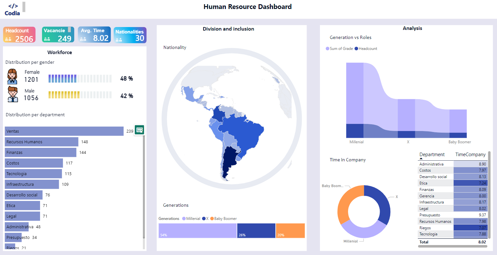

# Human Resource 2024 Dashboard 

To provide a comprehensive analysis of HR metrics across 30 countries in North and South America, using a visually cohesive blue-colored theme.
The dashboard will offer insights into workforce demographics, departmental distributions, and employee tenure, allowing HR teams to make data-driven decisions.

# Key Components:

# Map by Squillion:
Geographical Representation: Displays 30 countries across North and South America.

# Data Insights:
Allows users to view HR metrics on a country-by-country basis, such as headcount or vacancies.

# Cards:

Metrics Displayed: Four cards highlight key HR figures:
Headcount: Total number of employees.
Vacancies: Current job openings.
Average Time: Average time employees spend in the company.
Nationalities: Diversity in terms of the number of different nationalities.

# Gender Distribution:

Visualization: Graphical images and counts showing the number of male and female employees, along with percentages.
Purpose: To provide a clear view of gender representation within the organization.
Horizontal Bar Chart:
Distribution per Department: Visualizes the distribution of employees across various departments.

# Tree Map:

Generations: Represents the generational distribution within the workforce, allowing for insights into age demographics.

# Ribbon Chart:

Generation vs. Roles: Compares different generations within the workforce against the roles they occupy.

# Donut Chart:
Time in Company: Displays how long employees have been with the company, segmented by different time intervals.

# Table:
Department and Time in Company: Provides a detailed view of the time employees spend in the company, broken down by department.

# Design Considerations:

Theme: The entire dashboard will follow a consistent blue-colored theme to ensure visual harmony.
Interactivity: Users can interact with the map and charts to drill down into specific data points for more detailed analysis.
Usability: The layout is designed to be intuitive, with clear labels and tooltips to guide users through the data.

This project will deliver a powerful tool for HR teams to analyze and optimize workforce management across a broad geographical area.

# Power Bi | Data analysis | Data visualization | Dashboard 
